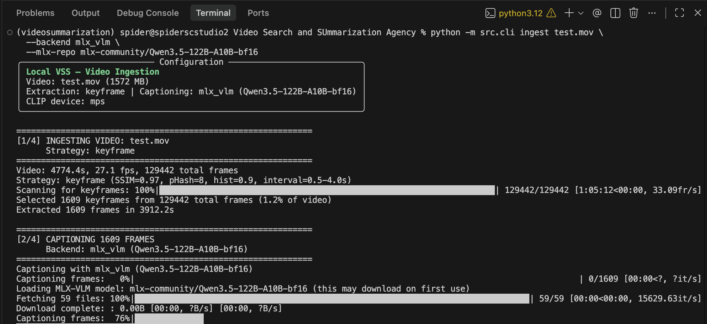
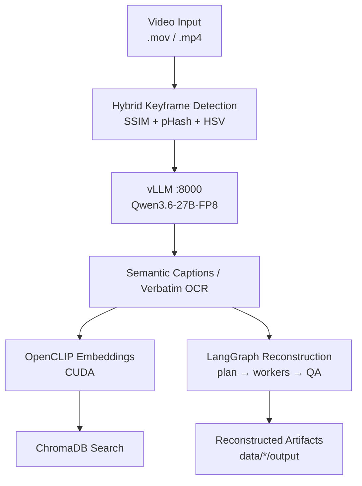

# ScreenLens-DGX

[](https://python.org)
[](docs/DGX_SPARK.md)
[](https://github.com/langchain-ai/langgraph)
[]()
[](https://github.com/ai-agents-cybersecurity)
[](LICENSE)

Local video scene intelligence for **NVIDIA DGX Spark** (GB10 / Linux aarch64). ScreenLens extracts meaningful frames from screen recordings, captions or transcribes them with a local multimodal vLLM model, embeds them with OpenCLIP on CUDA, indexes them in ChromaDB, and reconstructs visible code, documents, PDFs, and GUI walkthroughs.

This repository is the **DGX-only fork** of dual-platform `screen-lens`. Defaults are always **vLLM + CUDA + concurrency 2**. There is no macOS/oMLX product path.

## Demo



## Architecture



One canonical Qwen FP8 endpoint handles captioning, OCR, and reconstruction without duplicate weights or services. The shared OpenAI-compatible client lives in the legacy-named `omlx_client.py` module.

## Component Overview

| Component | Technology | Purpose |
|---|---|---|
| Frame extraction | Hybrid SSIM + pHash + HSV detection | Capture distinct screens while bounding long static intervals |
| Vision / text | `Qwen/Qwen3.6-27B-FP8` via vLLM | Semantic captions, OCR, summaries, and reconstruction |
| Optional fallback | Ollama | Alternative captioning when explicitly selected |
| Visual embeddings | OpenCLIP ViT-B-32 on CUDA | Semantic image/text vectors |
| Vector storage | ChromaDB | Persistent per-video semantic search |
| Reconstruction | LangGraph | Classify recordings and rebuild code/docs/demo artifacts with QA retries |
| Interfaces | Typer + Rich, optional Textual | CLI and terminal GUI |

## Platform Defaults

| Setting | Value |
|---|---|
| Inference | vLLM at `http://127.0.0.1:8000/v1` |
| Embeddings | CUDA |
| Caption / OCR concurrency | 2 |
| Python | 3.12 in `.venv-dgx` |
| Model | `Qwen/Qwen3.6-27B-FP8` |
| Served context | 262,144 tokens (caption output ceiling 32,768) |

## Installation

```bash
cd ~/Desktop/screen-lens-dgx
(umask 077; touch .env)
chmod 600 .env
${EDITOR:-nano} .env  # add HF_TOKEN=hf_... if ScreenLens must start vLLM

./setup_and_run_dgx.sh doctor
./setup_and_run_dgx.sh setup
./setup_and_run_dgx.sh llm-up
./setup_and_run_dgx.sh llm-wait
./setup_and_run_dgx.sh smoke
./setup_and_run_dgx.sh ocr-up
./setup_and_run_dgx.sh ocr-smoke
./setup_and_run_dgx.sh run
```

`run` launches the TUI with no arguments or passes a CLI command through:

```bash
./setup_and_run_dgx.sh run ingest input-videos/demo.mov
./setup_and_run_dgx.sh run ingest input-videos/demo.mov --hybrid-ocr
./setup_and_run_dgx.sh run transcribe input-videos/demo.mov
```

DigitalTwin uses the same model and loopback port 8000. The helper reuses an already-ready exact-model service instead of starting a conflicting container. See [the complete DGX Spark guide](docs/DGX_SPARK.md).

### Manual development install

```bash
# Only inside a CUDA-correct Spark venv (prefer setup_and_run_dgx.sh setup)
pip install -e ".[dev,tui]"
pytest tests/ -v
```

Install ffmpeg separately and ensure the vLLM server is running. Ollama is not required for the normal path.

## Usage

### Provider Selection

```bash
python -m src.cli ingest video.mov \
  --backend vllm \
  --inference-url http://127.0.0.1:8000/v1 \
  --inference-model Qwen/Qwen3.6-27B-FP8 \
  --inference-api-key local \
  --device cuda \
  --batch-size 2
```

`--vllm-url`, `--vllm-model`, and `--vllm-api-key` are aliases; legacy `--omlx-*` spellings remain accepted. `SCREENLENS_BACKEND`, `SCREENLENS_DEVICE`, and `SCREENLENS_BATCH_SIZE` override defaults. Credentials also come from `VLLM_*` (and optional `OCR_*`).

### Ingest and Search

```bash
python -m src.cli ingest "video.mov"

# Combine a short semantic caption with OCR from the shared endpoint.
python -m src.cli ingest "video.mov" --hybrid-ocr \
  --ocr-url http://127.0.0.1:8000/v1 \
  --ocr-model Qwen/Qwen3.6-27B-FP8 \
  --ocr-max-tokens 1024

# Optional Ollama captioning fallback.
python -m src.cli ingest "video.mov" --backend ollama --strategy fixed_fps --fps 1

python -m src.cli search "What application is shown?" --data-dir ./data --top-k 5
python -m src.cli run "video.mov" "Summarize the workflow"
```

Each ingestion creates `data/<stem>_<YYYYMMDD_HHMMSS>/` with independent frames, captions, and ChromaDB data.

### Batch Ingestion and Full-Video Summary

```bash
python -m src.cli batch input-videos/
python -m src.cli summarize
```

### Reconstruct and Assemble Artifacts

```bash
python -m src.cli reconstruct
python -m src.cli assemble
```

### Verbatim Transcription

```bash
python -m src.cli models
python -m src.cli transcribe input-videos/policies.mov --ocr-max-tokens 16384
python -m src.cli transcribe input-videos/document.mov --cleanup
```

Outputs are `transcript.raw.md`, `transcript.md`, `ocr/all_ocr.json`, and metadata under the timestamped data directory.

```bash
OCR_MODEL=Qwen/Qwen3.6-27B-FP8 \
OCR_BASE_URL=http://127.0.0.1:8000/v1 \
./setup_and_run_dgx.sh run transcribe input/part1.mov \
  --ocr-max-tokens 16384
```

### Status and TUI

```bash
python -m src.cli info
python -m src.cli tui
# or:
./setup_and_run_dgx.sh run
```

## Keyframe Detection

| Signal | What it detects | Threshold |
|---|---|---|
| SSIM | Pixel-level structural changes | < 0.97 |
| pHash | Perceptual content changes via DCT | hamming >= 8 |
| HSV histogram | Color-distribution shifts | correlation <= 0.90 |

A keyframe is emitted when any signal triggers and the minimum 0.5-second interval has elapsed. A forced keyframe every four seconds catches slow scrolling.

## Configuration

All settings live in `src/config.py` as Pydantic models. Key parameters:

| Parameter | Default | Description |
|---|---|---|
| `frame_extraction.strategy` | keyframe | Smart change detection or `fixed_fps` |
| `captioning.backend` | `vllm` | `vllm`, optional `omlx` alias, or `ollama` |
| `captioning.vllm_base_url` | http://127.0.0.1:8000/v1 | OpenAI-compatible API URL |
| `captioning.vllm_model` | null | Falls back to `VLLM_MODEL`, then checked Qwen |
| `captioning.batch_size` | 2 | Concurrent caption requests |
| `captioning.max_tokens` | 32768 | Caption ceiling; matching-context vLLM uses remaining space |
| `embedding.device` | `cuda` | OpenCLIP accelerator |
| `ocr.backend` | `vllm` | Vision endpoint for verbatim OCR |
| `ocr.concurrency` | 2 | Concurrent OCR requests |
| `ocr.max_tokens` | 16384 | Full-frame OCR output cap |
| `reconstruction.timeout_seconds` | 1800 | Long reconstruction HTTP timeout |

## Performance Notes

The shared Spark service admits two sequences and ScreenLens keeps concurrency at two. DGX Spark has one 128 GB unified-memory pool. The canonical FP8 27B service uses a `0.45` vLLM allocator target and a 262K context. See [the Spark memory notes](docs/DGX_SPARK.md#memory-and-performance-notes).

## Project Structure

```text
compose.dgx-spark.yaml # Isolated bounded ARM64/CUDA LLM service
docs/
  DGX_SPARK.md         # Setup, sizing, reuse, lifecycle, troubleshooting
setup_and_run_dgx.sh   # Checked Spark setup, validation, and launcher
src/
  config.py            # DGX-default Pydantic configuration
  frame_extractor.py   # Hybrid keyframe detection + fixed-FPS fallback
  captioner.py         # vLLM (+ optional Ollama) captioning
  embedder.py          # OpenCLIP embeddings on CUDA/CPU
  vector_store.py      # ChromaDB storage and search
  pipeline.py          # LangGraph ingest/search/summarize graphs
  reconstruct.py       # Artifact reconstruction with QA reflection
  frame_select.py      # Scroll-safe dense sampling for transcription
  ocr.py               # Verbatim vision OCR and capability probe
  stitch.py            # Text-space scroll-overlap stitching
  transcribe.py        # Verbatim pipeline and guarded cleanup
  omlx_client.py       # Shared inference client; legacy module name retained
  cli.py               # Typer CLI
  tui.py               # Optional Textual terminal GUI
tests/
  test_pipeline.py
  test_transcribe.py
  test_cases.yaml
```

Generated frames, captions, databases, videos, outputs, virtual environments, and model caches are ignored by Git.

## License

Apache 2.0 — see [LICENSE](LICENSE).
